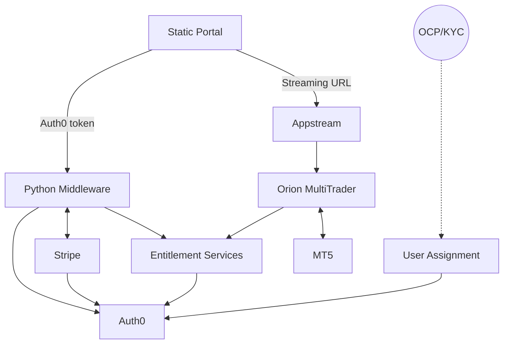

MAPS Infrastructure
====================

| Component       | Description             | UAT Environment  | Production Environment |
|-----------------|-------------------------|------------------|------------------------|
| Static Portal   | CloudFront distribution in front of static S3-hosted site | https://straits.orionmt.com | https://maps.straitsfinancial.com |
| Python Middleware | Python Flask site deployed using AWS Lambda | https://y5ywy4x9y8.execute-api.ap-southeast-1.amazonaws.com/prod | https://ys7l3q61yk.execute-api.ap-southeast-1.amazonaws.com/prod |
| Stripe          | Payment Processor                             | Stripe Test Environment | Stripe Live Environment |
| Auth0           | Identity Management Service | https://straits.au.auth0.com/   (SU2 Subscription) | https://straitsfinancial.au.auth0.com   ( Straits Financial)|
| User Assignment | AWS Lambda endpoint | https://vz90mhvzx4.execute-api.ap-southeast-1.amazonaws.com/prod | https://4kquofmih6.execute-api.ap-southeast-1.amazonaws.com/prod |
| Entitlement Services | Typescript service | https://appstream.oriontradingsystems.com | https://appstream.oriontradingsystems.com |
| Appstream       | AWS Appstream instance | StraitsDemo stack | Straits stack |
| Orion MultiTrader | Desktop Application running on Appstream | Hosted Windows app | Hosted Windows app |
